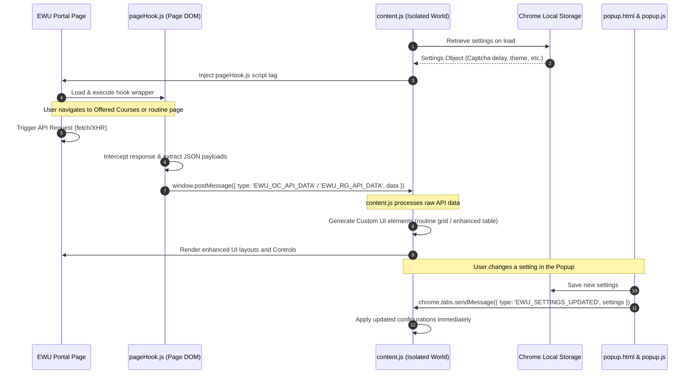

# EWU Portal Helper (V4) — Technical & Operational Walkthrough

Welcome to the comprehensive technical documentation for **EWU Portal Helper (v2.5.0)**. This document explains the extension's entire architecture, design patterns, file structure, operational steps, data flows, and sub-systems from **A to Z** in a way that is clear and understandable for both developers and non-technical readers.

---

## 1. Executive Summary & Capabilities

The **EWU Portal Helper** is a Google Chrome browser extension (built on Manifest V3) designed to significantly enhance the user experience of the East West University (EWU) Student Portal (`https://portal.ewubd.edu`). 

It provides three core modules:
1. **Auto Captcha Solver (Login Helper):** Automatically extracts and solves mathematical captchas on the login screen, inputs the answer, and triggers Angular change detection so students can log in with a single click.
2. **Routine Generator:** Intercepts student advising data from API network responses, parses it, merges course listings, and renders a professional, color-coded, interactive class routine. Users can download this routine as a high-quality image or PDF.
3. **Offered Courses Enhancer:** Intercepts the portal's raw offered course dataset, converts the complex structure into an interactive 9-column spreadsheet-like interface, displays real-time statistics (total courses, seats filled, remaining seats), and adds instant filtering, searching, and PDF exports.

---

## 2. Extension File Architecture

The codebase consists of the following components:

```
ewu-buddy/V4/
├── manifest.json              # Extension metadata, permissions, content scripts, and page injection rules
├── content.js                 # Primary extension script; executes in isolated world context; runs core logic
├── pageHook.js                # Web-accessible script injected directly into portal page DOM context
├── styles.css                 # Custom glassmorphism interface styles and animations
├── popup.html                 # Settings menu interface rendered when clicking the extension icon
├── popup.js                   # Client-side configuration manager for the popup
├── README.md                  # Quick user guide and developer setup instructions
├── Details.md                 # [This File] Full A to Z technical documentation
├── lib/
│   ├── html2canvas.min.js     # Library used to convert HTML preview structures into images
│   └── jspdf.umd.min.js       # Library used to generate and download multi-column PDFs
└── icons/
    ├── icon16.png             # Extension logo (16x16 px)
    ├── icon48.png             # Extension logo (48x48 px)
    └── icon128.png            # Extension logo (128x128 px)
```

### Context Isolation: Isolated World vs. Page DOM
Chrome extensions enforce a boundary between the **Isolated World** (where `content.js` runs) and the **Main Page DOM** (where the portal's Angular code runs).
- **Isolated World (`content.js`):** Has full access to the page's HTML structure (DOM) and Chrome Extension APIs (`chrome.storage`, `chrome.runtime`), but *cannot* read Javascript variables, functions, or network responses bound to the page's global `window` scope.
- **Main Page DOM (`pageHook.js`):** Injected directly into the website's `<head>` by `content.js`. It runs with full access to the portal's native `window` object, allowing it to hook HTTP requests (`fetch` and `XMLHttpRequest`) and intercept raw API datasets. It communicates intercepted data back to `content.js` via browser messaging (`window.postMessage`).

---

## 3. Detailed Data Flow & Messaging Architecture

The diagram below outlines how the components interact during a portal browsing session:



---

## 4. Sub-System Mechanics

Let us look under the hood of each functional module in the system.

### A. SPA (Single Page Application) Route Handler
The EWU Portal uses frontend routing (Angular). Instead of reloading the page when you switch tabs, it dynamically swaps out content. To handle this, `content.js` implements a custom observer to detect page navigation:
1. **API Interception of History:** It hooks `history.pushState` and `history.replaceState`, wrapping them to fire a custom browser event named `locationchange`.
2. **State Listeners:** It listens to `popstate` (browser back/forward button clicks) and the custom `locationchange` event.
3. **Execution Manager:** When navigation occurs, it cleans up existing elements, runs `loadModules()`, checks the current URL path, and initializes the corresponding module.

---

### B. Auto Captcha Solver (Login Helper)
When on `https://portal.ewubd.edu/` or `/Account/Login`:
1. **Operand Capture:** It queries the login form elements. Depending on how the page loaded, it grabs the operands from hidden inputs (`FirstNo`, `SecondNo`) or text labels (`#lblFirstNo`, `#lblSecondNo`).
2. **Mathematical Operation:** It reads the operation text (usually a plus sign "+") and performs the calculation:
   $$\text{Answer} = \text{Operand 1} + \text{Operand 2}$$
3. **Delayed Fill & Angular Triggering:**
   - Wait for the user-defined delay (default `100ms`).
   - Populate input field `#lblcaptchaAnswer` with the answer.
   - Fire a sequence of events (`focus`, `input`, `change`, `keyup`, `blur`) on the input field. This tells the portal's Angular code that the value has changed, enabling the "Log In" button.
4. **Visual Indicator:** Temporarily adds the CSS class `ewu-lh-filled` to flash a success visual around the captcha input.

---

### C. Class Routine Generator
When on `/Home/ClassSchedule`:
1. **API Interception:** The script listens for intercepted payloads from `GetSemesterStudentWiseAdvisingCourseListStudent`.
2. **Data De-duplication & Merging:**
   The Raw API lists each scheduled class day as a separate row. For example, if a course runs on Monday and Wednesday, the API returns two items. The Routine Generator merges these items by comparing `CourseCode` and `SectionName`.
3. **Mapping Day Codes:**
   It maps code abbreviations to readable days:
   - `A` $\rightarrow$ Saturday
   - `S` $\rightarrow$ Sunday
   - `M` $\rightarrow$ Monday
   - `T` $\rightarrow$ Tuesday
   - `W` $\rightarrow$ Wednesday
   - `R` $\rightarrow$ Thursday
   - `F` $\rightarrow$ Friday
4. **Routine Grid Assembly:**
   - It organizes slots by time (e.g., `08:00 AM - 09:30 AM`) and day rows.
   - It assigns a color to each course using a predefined palette based on the course code hash.
   - It creates an overlay modal containing a clean grid layout.
5. **Exports:**
   - **Image:** Uses `html2canvas` to screenshot the `#ewu-rg-preview` DOM container and downloads it as a `.png` file.
   - **PDF:** Captures the canvas via `html2canvas`, sets the format to A4 Landscape, scales it to fit, and exports via `jspdf`.

---

### D. Offered Courses Enhancer
When on `/Home/OfferedCoursesStudent`:
1. **API Interception:** `pageHook.js` intercepts calls to `GetAllOfferedCourses`.
2. **Data Extraction:**
   It maps the raw API array into clean records. For example, it parses a time slot string like `"MW 08:00 AM - 10:00 AM"` into readable components:
   - Days: `"Mon, Wed"`
   - Time: `"08:00 AM - 10:00 AM"`
3. **Table Rebuilding:**
   It constructs a custom table with **9 columns**:
   1. **Course:** Course Code and Name.
   2. **Section:** Class section letter.
   3. **Faculty:** Full name and short code.
   4. **Seats (A/T):** Available vs. Total seats (with progress bar).
   5. **Left:** Remaining seats.
   6. **Days:** Scheduled class days.
   7. **Time:** Class time slot.
   8. **Room No.:** Assigned room.
   9. **Dedicated Department:** The specific department this section is reserved for.
4. **Controls Bar:**
   Injects a toolbar above the table featuring:
   - **Search Input:** Instantly filters table rows by course code, title, section, or faculty.
   - **Show Available Toggle:** Hides sections where remaining seats are zero or negative.
   - **Live Counters:** Displays real-time stats (e.g., "Showing 45 of 210 sections | 1200 / 3400 Seats Filled").
5. **PDF Export:** Reads the rendered DOM table and constructs a clean PDF document using `jspdf` (excluding the *Dedicated Department* column to fit an A4 page).

---

### E. Notification Toast System
Provides a sleek, non-intrusive alert system built with glassmorphic styling:
- **Deduplication:** Prevents duplicate alerts from spamming the user by tracking active messages and ignoring identical alerts within a 4-second window.
- **Visuals:** Uses glass-tinted backgrounds, color-coded borders (green for success, red for error, blue for info), and white text for readability.

---

## 5. Captures and API Field Map References

Here is how the API payload fields map to the custom interface:

### Offered Courses API Mapping
| API Response Property | UI Placement / Action | Description |
| :--- | :--- | :--- |
| `CourseId` / `CourseCode` | **Course** Column | e.g. `CSE103` |
| `CourseTitle` | **Course** Column | e.g. `Structured Programming` |
| `SectionName` | **Section** Column | e.g. `1` |
| `FacultyShortName` / `FacultyName`| **Faculty** Column | e.g. `MSR (Md. Sazid Rahman)` |
| `TotalSeat` | **Seats (A/T)** Column | Denominator (Total capacity) |
| `EnrollSeat` | **Seats (A/T)** Column | Numerator (Enrolled students) |
| `AvailableSeat` | **Left** Column | Computed remaining slots |
| `TimeSlotName` | **Days** & **Time** Columns | Parsed to separate day labels from time ranges |
| `RoomName` | **Room No.** Column | e.g. `124` |
| `DeptName` | **Dedicated Department** Column| Department reservation constraints |

---

## 6. How to Edit or Extend This Extension

If you want to modify features in the codebase, keep these guidelines in mind:

1. **Changing CSS Styles:**
   All design tokens (colors, animations, fonts, and layout styles) are stored in `styles.css`. Keep styles structured to preserve the modern glassmorphism design.
2. **Modifying Network Hooks:**
   To intercept a new API endpoint, add a handler inside `pageHook.js` and listen for it in the message handler inside `content.js`.
3. **Updating Configuration Settings:**
   - Update default options in the `DEFAULT_SETTINGS` object within `content.js`.
   - Update the UI controls in `popup.html` and their event logic in `popup.js`.

---

## 7. Developer Validation & Testing Checklist

When testing changes locally, make sure to verify:
- [ ] **Captcha Auto-Solve:** Confirm captcha values parse correctly on load and that the Angular login button activates.
- [ ] **Route Changes:** Click around the portal tabs (Advising $\rightarrow$ Offered Courses $\rightarrow$ Home) to verify the SPA handler triggers and loads modules correctly on each view.
- [ ] **Table Operations:** Test that searches, toggles, and column sorting work smoothly without errors on the Offered Courses page.
- [ ] **Routine Layouts:** Open the routine generator modal and check that the layout is responsive and scales correctly on different screen sizes.
- [ ] **Export Options:** Verify that both PNG and PDF downloads function correctly, preserve formatting, and save to your local machine.

---
*Document Version: 1.0.0 | Date: June 2026 | Project: EWU Portal Helper V4*
